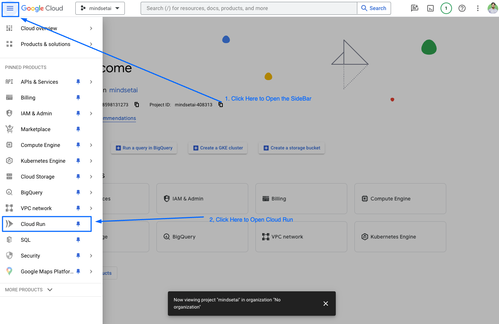
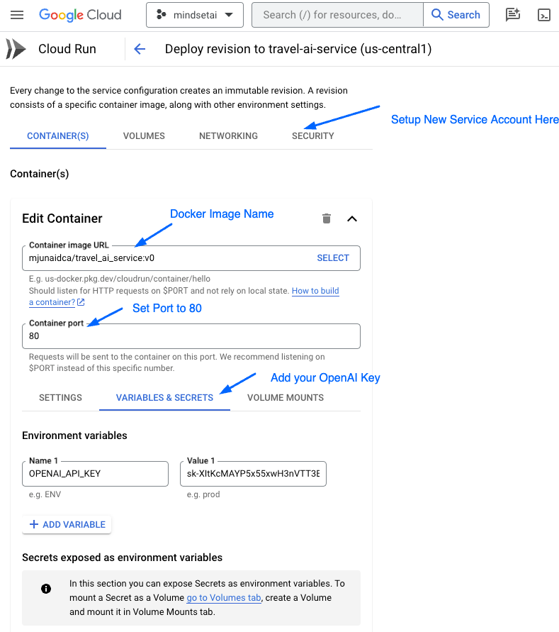
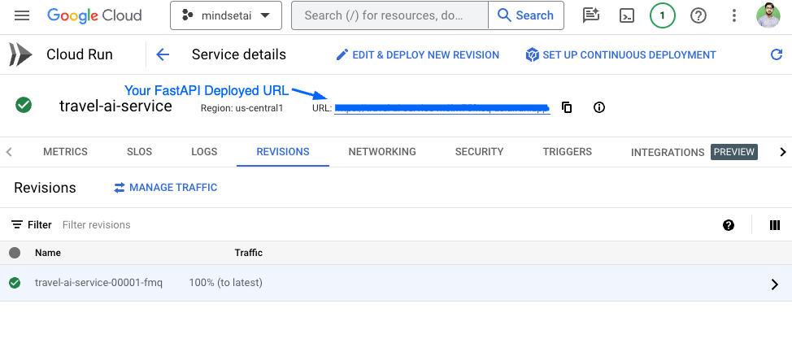

# Deplpoy OpenAI Streaming FastAPI MicroService to Google Cloud

Now let's get the dev ops hats and deploy the API we have completed in Step 01.

Here's what we will do now:
0. Prepare our codebase to build docker image
1. Build Docker Image
2. For this image run the Docker Containor Locally and Test API Routes
3. Push Docker Image to Docker Hub
4. Deply the Image Containor on Google Run.

## 00. Prepare our codebase to build docker image

Go to backend dir and create the following files

- .dockerignore 
    - Purpose: add all files that shall not be commited to docker hub i.e: .env, google service credentials. 
    - ToDo: For now only add .env here.
- requirements.txt
    - Purpose: specify the dependencies that your project needs to run. 
    - ToDo: add (fastapi, openai, uvicorn, mpython-dotenv, SQLAlchemy, psycopg2)
- Dockerfile
    - Purpose: a text document that contains all the commands a user could call on the command line to assemble an image. It's essentially a blueprint for building a Docker image.
    - ToDo: copy the Docker file and paste it.

Here's the breakdown of Dockerfile:

- ```FROM python:3.12```
Starts building the image from the Python 3.12 base image.

- ```WORKDIR /travel_ai_service```
Sets the working directory in the container to /travel_ai_service.

- ```COPY ./requirements.txt /travel_ai_service/requirements.txt``` Copies the requirements.txt file from your project to the container's working directory.

- ```RUN pip install --no-cache-dir --upgrade -r /travel_ai_service/requirements.txt``` 
Installs Python dependencies defined in requirements.txt without caching them, to minimize image size.

- ```COPY ./app /travel_ai_service/app``` 
Copies your application code into the /travel_ai_service/app directory inside the container.

- ```CMD ["uvicorn", "app.main:app", "--host", "0.0.0.0", "--port", "80"]``` 

Configures the container to run your FastAPI application using Uvicorn on port 80, accessible from outside the container.

## 01. Build Docker Image
Open Docker and then run the following command to build your docker image.

- For Windows and Mac M1 users run the following command:

    - `docker build -t mjunaidca/travel_ai_service:v0 .`

- For Mac M2 Users use this command instead (using the above command on M2 results in containor deplyment error on Google Run): 

    - `docker buildx build --platform linux/amd64 --no-cache -t mjunaidca/travel_ai_service:v0 .`

Replace mjunaidca with your docker username. 

Here the breakdown of docker build command:

- docker buildx build: This command uses Docker Buildx, an extended build feature of Docker, enabling more advanced build capabilities like building multi-platform images.

- --platform linux/amd64: Specifies the target platform for the build. In this case, it's set to linux/amd64, meaning the image is being built for the AMD64 architecture on Linux, which is a common architecture for desktops and servers.

- --no-cache: Instructs Docker to build the image without using any cache from previous builds. This ensures every image layer is built freshly, ensuring that the latest versions of dependencies are used.

- -t mjunaidca/travel_ai_assistant:v0: Tags the built image. -t stands for 'tag'. mjunaidca/travel_ai_assistant is the repository name you're giving to the image, and v0 is the tag/version of this particular build. This makes it easy to identify, manage, and run the correct version of your image.

- `.` Specifies the build context to the current directory. Docker will look for the Dockerfile in this directory.

## 02. For this image run the Docker Containor Locally and Test API Routes

#### 1. View all images

`docker images`

#### 2. Run the Contianer for this Image

 `docker run --env-file .env -d --name v0_travel_ai_service -p 80:80  mjunaidca/travel_ai_service:v0 `

- --env-file flag let us pass the environment variables (OPENAI_API_KEY) here when running the container

- -d runs the containor in detached mode so we can use the terminal

- travel_ai_service is the containor name

- -p 80:80 runs containor on docker port 80 and our local machine port 80

- mjunaidca/travel_ai_service is our image name (tagged one)

- :v0 specifies the version of image we want to run.

#### 3. Verify that the containor is running

`docker ps`

If containor is not running then you can check logs with command `docker logs travel_ai_service` where travel_ai_service is the containor name

#### 4. Test the Local Container
Test the containor by opening followig URLs on web.

http://localhost:80/

http://localhost:80/docs

http://localhost:80/openai-streaming/?query=Hello

http://localhost:80/openai-streaming/?query="Let's visit Japan"

http://localhost:80/openai-streaming/map-coordinates

http://localhost:80/openai-streaming/get-all-messages-before-saved

http://localhost:80/openai-streaming/get-db-chat

http://localhost:80/openai-streaming/save-db-chat

http://localhost:80/openai-streaming/get-db-chat

Cool we just ended up executing all endpints and it's working perfectly. Let's just push it on Docker Hub.

## 03. Push Docker Image to Docker Hub

```
 docker push mjunaidca/travel_ai_service:v0
```

Visit hub.docker.com and view your image.

Currently it will have 0 pulls as it is freshly pushed on docker.

Time to deply it!

## 04. Deply the Image Containor on Google Run.

Visit https://console.cloud.google.com/

Setup a new project if you don't have any existing project.

Now tap on menu icon in top left to Open the sidebar and "Cloud Run"



Then Click on "Create Service" from the Top Bar.

Next add your "Container image URL". It's the same that we pushed on docker hub. From me it was: 

`mjunaidca/travel_ai_service:v0`

Name Your Service i.e: travel-ai-service

In Authentication * for now click on 
`Allow unauthenticated invocations`

NOTE: REMEMBER WE WILL HAVE TO LATER SECURE OUR API OR ELSE ....

Just above the CREATE Button you will have ```Container(s), Volumes, Networking, Security``` expander.



Expand it by clicking on it.

1. Make Containor Port: 80
2. Below this Port Option are 3 tabs. Click ```VARIABLES & SECRETS ```
and tap on + ADD VAARIABLE. and add ```OPENAI_API_KEY```
3. Next Go to Security Tab > selet Service account > "Create new service account" > Select Editor Role. Click on Done

Finally click in `CREATE` button and wait for a moment. 

Within 2-3 minutes you will have the containor up and running. 

Test your URL with all the endpoints we ran tests for after running the containor locally.



## Next Steps

Great - devops engineer you just deployed your FastAPI Streaming microservice on Google Cloud Run.

It's time to power the frontend now. Wear your Frontend Enjineer Hat and let's quickly create streamlit frontend before getting hands on NextJS 14.

See you in Step 3.