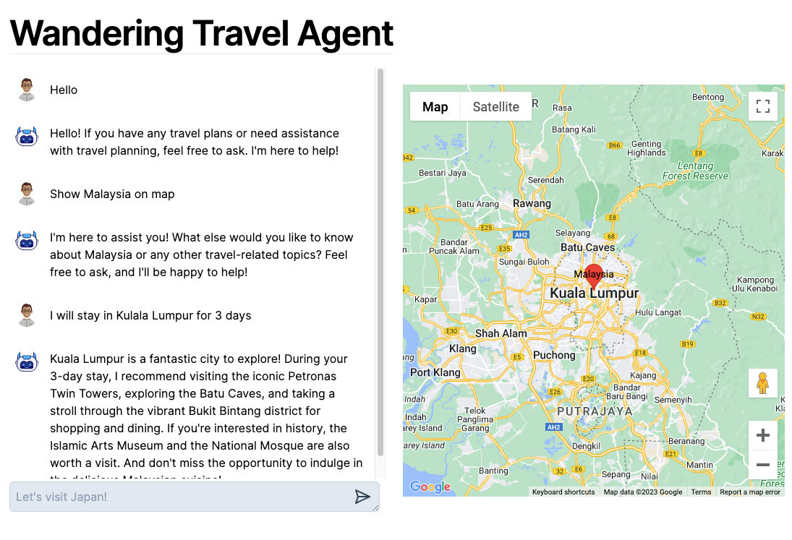

## NextJS 14 Starter Kit for FastAPI Micoservice.

### StarterKit Components

You will have following components in this Starter Kit.

1. API routes to get stream and update map
2. Google Maps component tht takes coordinated and update map
3. Complete Form to Submit Prompt and Stream API Response and Update MAP.
4. A Chat UI Interface Component to show User and AI Chat.

You can either clone this project or setup a new project and take code from here!



In terminal go to your nextjs folder and run the following command

``` pnpm create travel-ai . ```

Once the project is installed in terminal run the command `pnpm dev` and open localhost:3000 in browser.

#### Get Google Maps API Key

To create in interactive maps experience we will be using Google Maps. 

Quick visit Google Cloud > Search Google Maps API key and enable "Maps Javasript API"

#### Setup Environment Variables

Create a .env file in your nextjs project directory and add following env variables:
1. NEXT_PUBLIC_JS_GOOGLE_MAPS_KEY
2. NEXT_PUBLIC_FASTAPI_BACKEND_URL:

- For 2nd one it can be your Google Run deployed URL or you can also add the localhost:8000 and run the backend locally or in docker contianor.


### 1. Create Google Maps Component

Create a component `GoogleMapComponent` that can take arguments and display the Google Map.

I asked ChatGPT and it generated a fully working component

```
"use client";

import { GoogleMap, MarkerF, useLoadScript } from "@react-google-maps/api";
import { FC } from "react";

interface GoogleMapComponentProps {
  center: { lat: number; lng: number };
  zoom: number;
  markers: Array<{ lat: number; lng: number; label: string }>;
}

const GoogleMapComponent: FC<GoogleMapComponentProps> = ({
  center,
  zoom,
  markers,
}) => {
  const { isLoaded, loadError } = useLoadScript({
    googleMapsApiKey: process.env.NEXT_PUBLIC_JS_GOOGLE_MAPS_KEY!,
    libraries: ["places"],
  });

  if (loadError) return <div>Error loading maps</div>;
  if (!isLoaded) return <div>Loading...</div>;

  return (
    <div className="h-[400px] sm:h-[460px] md:h-[520px] lg:h-[570px] xl:h-[600px] w-full">
      <GoogleMap
        zoom={zoom}
        center={center}
        mapContainerStyle={{ width: "100%", height: "100%" }}
      >
        {markers.map((marker, index) => (
          <MarkerF
            key={index}
            position={{ lat: marker.lat, lng: marker.lng }}
            label={marker.label}
          />
        ))}
      </GoogleMap>
    </div>
  );
};

export default GoogleMapComponent;

```

Install the package `pnpm add @react-google-maps/api`

Now in your app/page.tsx import this component and display it with dummy values

```
<GoogleMapComponent
    center={lat: 39.949610, lng: -75.150282,}
    zoom={16}
    markers={null}
/>
```

Now open your browser and you will Google Maps present in your screen.

Pat your self. You just integrated Google Maps in your NextJS14 project.

Now let's setup a chat interface.

### 2. A Simple Chat Interface.

IN Components create a new component "ChatUiInterface". This will simply take the User and AI message and display them.

```
import Image from "next/image";
import HUMAN from "/public/human.png";
import AIIMAGE from "/public/ai.png";

export const ChatUI = ({sender, message}: {sender: any; message: any;}) => {
  return (
    <div
      className={`message ${sender === "user" ? "user-message" : "ai-message"}`}
    >
      <div className="flex flex-row px-2 py-4 sm:px-4">
        <Image
          className="mr-2 flex h-8 w-8 rounded-full sm:mr-4"
          src={sender === "user" ? HUMAN : AIIMAGE}
          alt={sender}
        />
        <div className="flex max-w-3xl items-center">
          <p>{message}</p>
        </div>
      </div>
    </div>
  );
};
```

And quickly add 2 images in your nextjs public directory. Download them from pexels or within this project

- human.png
- ai.png

### 3. A Form to Submit Prompt and Stream API Response.

Import the ChatUI in a new component app/ui/OpenAIChatBoxand add the following code.
Remember to import this Component in your app.page.tsx file.

This simple component wil give your the streaming interface and updates the map once the text stream is connected. 

### 4. Setup a Consume Stream Function to handle incoming text stream and complete handleSubmit logic.

Here a simple function that will take response.body from retunred from our api route and stream it on the frontend

```
async function consumeStream(
  response: any,
  updateAiResponse: any,
  setError: any
) {
  const reader = response.body.getReader();
  try {
    while (true) {
      const { done, value } = await reader.read();
      if (done) {
        break;
      }
      const textChunk = new TextDecoder("utf-8").decode(value);
      updateAiResponse(textChunk); // Update with each new chunk
    }
  } catch (error) {
    setError("Error while reading data from the stream.");
    console.error("Stream error:", error);
  }
}
```

Now let's complete this component quickly:

```

  const updateAiResponse = (newChunk: any) => {
    setConversation((prevConvo: any) => {
      const lastEntry =
        prevConvo.length > 0 ? prevConvo[prevConvo.length - 1] : null;
      if (lastEntry && lastEntry.sender === "AI") {
        return [
          ...prevConvo.slice(0, -1),
          { ...lastEntry, message: lastEntry.message + newChunk },
        ];
      } else {
        return [...prevConvo, { sender: "AI", message: newChunk }];
      }
    });
  };


  const handleSubmit = async (e: any) => {
    e.preventDefault();
    if (!inputValue) return;

    setIsLoading(true);
    setError(null);

    setConversation([...conversation, { sender: "User", message: inputValue }]);

    try {
      const response = await fetch(
        `/api/streaming-gemini?query=${inputValue}`,
        {
          cache: "no-store",
        }
      );

      if (!response.ok) {
        throw new Error(`API request failed with status ${response.status}`);
      }

      consumeStream(response, updateAiResponse, setError);
      setInputValue("");

      await updateMapState(); // Update the map state after stream is complete
    } catch (error: any) {
      setError(error.message);
      console.error("Error sending message:", error);
    } finally {
      setIsLoading(false);
    }
  };
```

## Deploy on Vercel

The easiest way to deploy your Next.js app is to use the [Vercel Platform](https://vercel.com/new?utm_medium=default-template&filter=next.js&utm_source=create-next-app&utm_campaign=create-next-app-readme) from the creators of Next.js.

Check out [Next.js deployment documentation](https://nextjs.org/docs/deployment) for more details.
