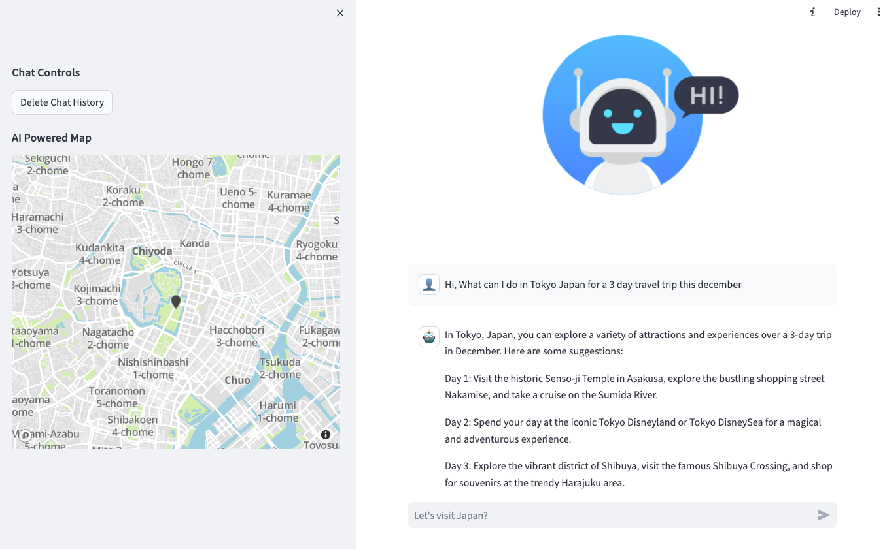

# Create NextJS14 & Streamlit Frontend For Deployed Step2 Microservice

Let's quickly setup the Streamlit Frontend before moving on NextJS 14.

Your existing project structure shall be like following

```
travel-ai-service
    \backend
        \app
        ...
    ...
    \streamlit
    \nextjs
```
Now create 2 new folders and rename them as you like. Navigate to the streamlit Folder.

## Building Streamlit Frontend

For streamlit to plot maps we will use the Step00-openai_streaming.ipynb map code that we didn't use in Step 01.

Create a .env file save the following variables

- BACKEND_FASTAPI_URL (your Google Run deployed URL or you can also add the localhost:8000 and run the backend locally or in docker contianor)
- MAPBOX_TOKEN (optional if you want to make plotly maps UI for better)

For MAPBOX_TOKEN visit https://www.mapbox.com/ > signup and copy your default public token.

## Now let's create the streamlit frontend. 



Here's the breakdown component architecture breakdown:

#### A. Project
- We will have Chat Controls and the Updated Map in Sidebar
- And in the Map we have
    - A simple Lottie Animation
    - A Chat Component and Streaming Pipeline

#### B. Session
We will have following session_state varibles:
    1. map_state: to control the map.
    2. messages: to show complete users chat

#### C. Flow
- Main Interface User Interaction
1. The Existing Chat Messages if any are displayed
2. User will enter the prompt and press Enter
3. We will call backend API and Stream the Text Response
4. After Stream Complete we will call another API route to fetch latest chat
5. Update Map location and Place Markers if any
6. Once the response is streamed and map is updated we will At the end call save_db_chat endpoint to save chat in database

- Sidebar User Interaction
1. On "Delete Chat" button click remove chat from database and state. And give users  a clean toast message
2. On Map Markers Hover show Marker Location and coordinates
    
#### How to Handle Streaming Response in Streamlit?

We will use requests library to consume the stream.

https://medium.com/pipeline-a-data-engineering-resource/stream-your-data-using-nothing-but-pythons-requests-library-970f749db952

https://noplacelikelocalhost.medium.com/implementing-streaming-with-fastapis-streamingresponse-part-1-edf4c55a4132


## Building NextJS 14 Frontend

For NextJS you will have a start kit code that features

1. Show Maps using Google Maps JS API
2. Consume FastAPI Stream 
3. Update the map.

From here you will complete the frontend just like we did here. 

Use this starter kit as an Inspiration and use Server Actions and all new features of NextJS14.

#### Get the Starter kit code and features overview in nextjs/README.md file!